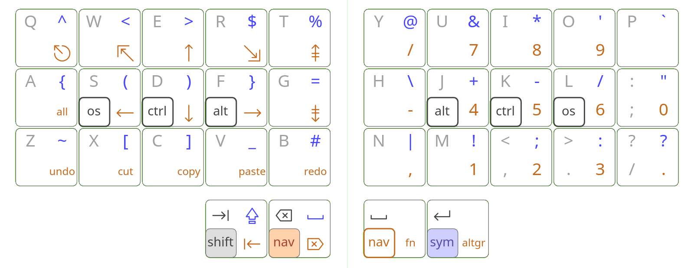
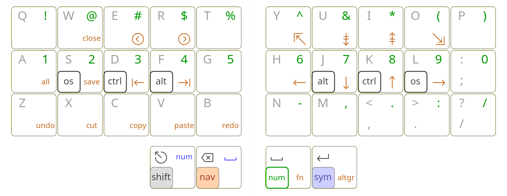

# Selenium

An [Arsenik] variant for split keyboards.

[Arsenik]: https://github.com/OneDeadKey/arsenik

Vim variant:

Web page: https://onedeadkey.github.io/selenium/

Reference implementation: https://github.com/Nuclear-Squid/zmk-keyboard-quacken/
