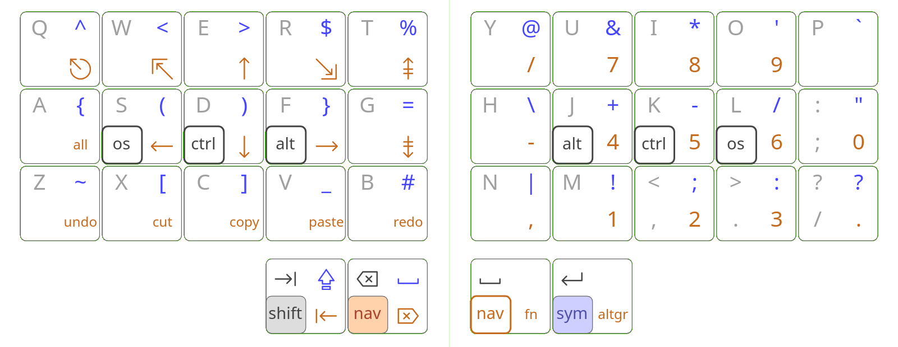
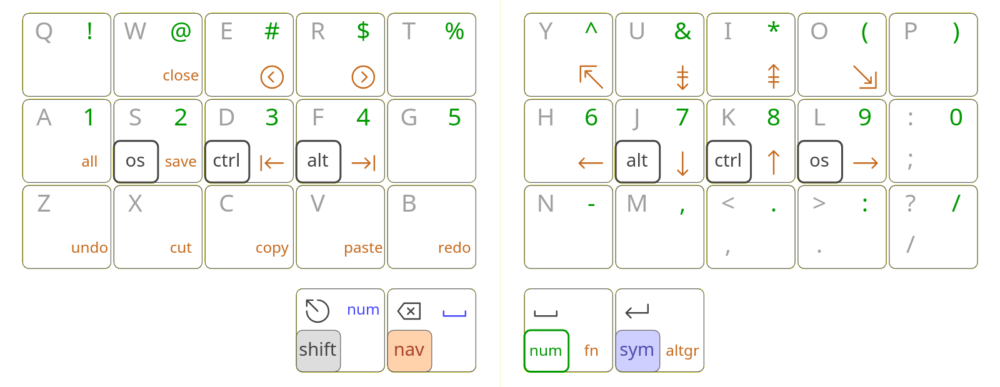

# Selenium

An [Arsenik] variant for split keyboards.

Vim variant:

Reference implementations:
- [ZMK-config-Ækeynox]
- [QMK-config-Ækeynox]

Web page: https://onedeadkey.github.io/selenium/

[Arsenik]:            https://github.com/OneDeadKey/arsenik
[ZMK-config-Ækeynox]: https://github.com/OneDeadKey/zmk-config-aekeynox
[QMK-config-Ækeynox]: https://github.com/OneDeadKey/qmk-config-aekeynox
